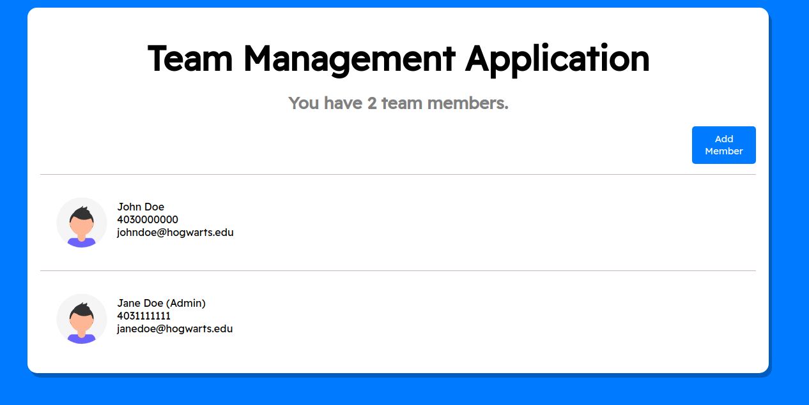
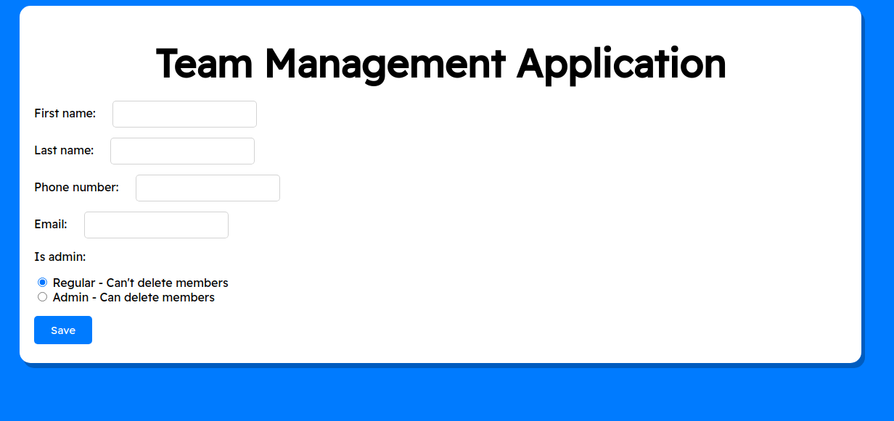
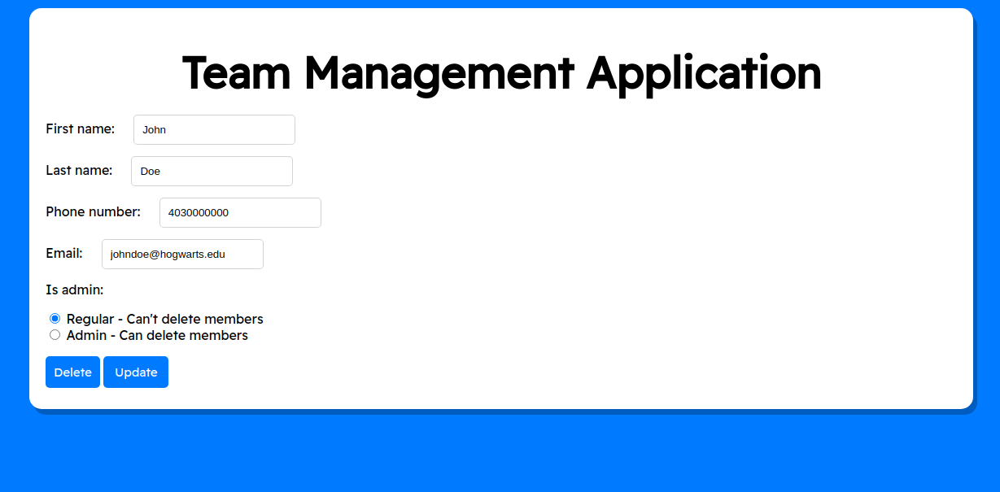

# Team Management Application

Small application for managing teams. Written in Python and Django.

## Setup
1. Clone this repository.
2. Setup your venv and run `pip install -r requirements.txt`.
3. Setup the SQLite database by running `python manage.py migrate`.
4. Start the server by running `python3 manage.py runserver`.
5. View the development server!

## Testing

The main development code is housed under the `/manager` folder.

1. To add a new teammate, click the 'Add Member' button on the right hand side of the main page.
2. To edit a existing teammate, click anywhere on the teammate profile on the main page list.
3. To delete a teammate, click on the teammate profile and click delete.
4. To return to the main page, click the 'Team Management' banner.

## Images

